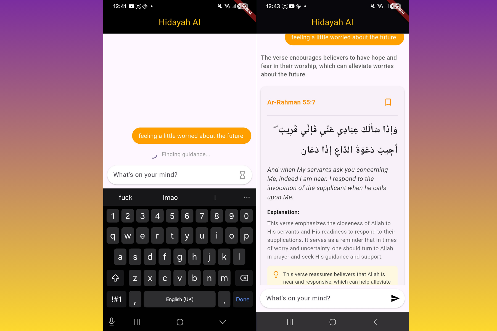

# Hidayah AI

A Quranic verse finder powered by semantic search and LLM responses. Ask a question or describe what you're looking for, and Hidayah AI surfaces the most relevant verses with context.

> **Backend repo:** [hidayah-backend](https://github.com/emmanueluwa/verses_v1)



## Features

- Semantic search over Quran verses using OpenAI embeddings and Pinecone
- LLM-generated answer summaries with verse recommendations
- Clean chat interface built with Flutter
- Bookmark verses for later reference

## Tech Stack

- **Frontend:** Flutter (Dart)
- **Backend:** FastAPI (Python) — [hidayah-backend](https://github.com/emmanueluwa/verses_v1)
- **Search:** Pinecone vector database
- **AI:** OpenAI embeddings + LangChain

## Getting Started

```bash
# Backend
uvicorn main:app --reload

# Frontend
flutter pub get
flutter run
```

## Environment Variables

```env
OPENAI_API_KEY=your_key
API_URL=http://your-backend-url
```
